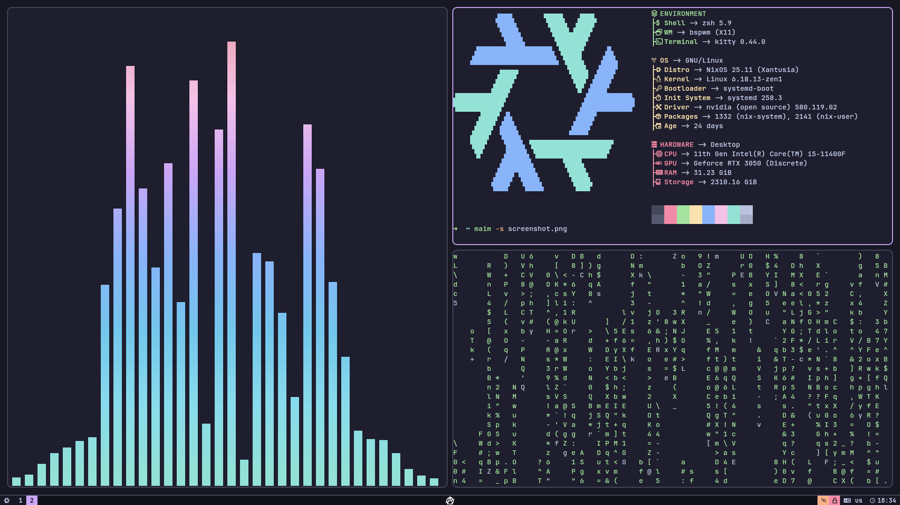

# ❄️ NixOS & Home Manager dotfiles

This configuration is primarily designed for my personal workflow, hardware, and preferences. It is not a general-purpose setup and should not be expected to work out of the box on other systems.

You are welcome to reuse parts of it, but expect to adapt and modify it to fit your own environment.

## ⚙️ Hosts

The configuration defines two NixOS hosts:

- **pc** — main desktop system with a full graphical environment and daily-use applications.

- **srv** — minimal, server-oriented setup without a graphical environment, focused on services and background tasks.

The difference between them is mainly the presence of a desktop stack and a few service-related adjustments.

## 🏠 Users

There is a single user: **segabass65**.

User configuration is not global. Instead, it is defined per-host, meaning the same user can have different environments depending on whether they are running on **pc** or **srv**.

This design keeps user configuration tightly coupled to the system it runs on, rather than abstracting it into a shared global layer.

## 🔍 Overview



<h3 align="center">segabass65@pc</h3>

---

- 🚀 Shell: zsh  
- 🧱 WM: bspwm  
- 📊 Bar: polybar  
- 📟 Terminal: kitty  
- ...

## 📜 Architecture notes

This flake is structured around two core abstractions:

- `nixosSystem` — a helper for defining NixOS hosts with shared defaults.

- `homeManagerConfiguration` — a helper for defining Home Manager environments.

These helpers exist to reduce repetition and centralize common configuration logic across hosts and users.

A key design decision is that Home Manager is instantiated from an existing NixOS system configuration.

This means every Home Manager environment receives system-level configuration context via `osConfig`.

This approach ensures consistent access to system configuration options inside Home Manager modules, even in standalone usage.

Without this design, `osConfig` would only be available when Home Manager is used as a NixOS module directly.

As a result, every Home Manager configuration in this flake is explicitly tied to a corresponding NixOS host.

## ⬇️ Installation

This configuration supports both NixOS and non-NixOS systems, as long as Nix with flakes support is enabled.

### 📌 Requirements

- Nix (with flakes enabled)
- Git
- Home Manager (required only on non-NixOS systems)

### ❄️ NixOS

On NixOS, systems are defined via `nixosConfigurations`.

To apply a system configuration, use:

```bash
sudo nixos-rebuild switch --flake .#pc
```

(or `srv`, depending on the host)

### 🐧 Non-NixOS systems

On non-NixOS systems, user environments are activated via `homeConfigurations`.

To apply a Home Manager configuration, use:

```bash
home-manager switch --flake .#segabass65@pc
```

(or `segabass65@srv`, depending on the target host)

Each Home Manager configuration must match its corresponding host to ensure access to the correct system configuration context.
