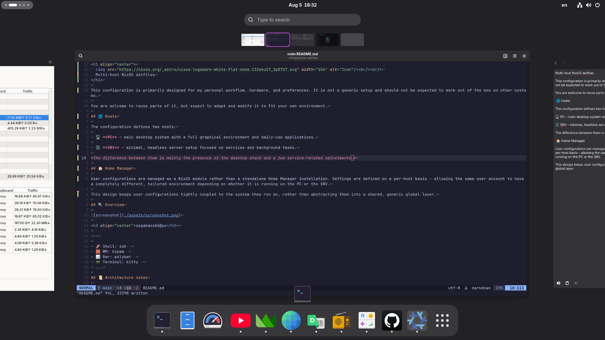

<h1 align="center">
  <br/><br/>
  Multi-host NixOS dotfiles
</h1>

This configuration is primarily designed for my personal workflow, hardware, and preferences. It is not a generic setup and should not be expected to work out of the box on other systems.

You are welcome to reuse parts of it, but expect to adapt and modify it to fit your own environment.

## 🔍 Overview

> [!WARNING]
> This screenshot only showcases the DE and the text editor. Any other applications or tools shown may not be included in the repository, as they were installed non-declaratively.



---

### ➜ ~ dotfetch

> [!TIP]
> Starred items (⭐) highlight configuration differences between hosts.

<table>
  <tr>
    <td>
      <br>
      
    </td>
    <td>

|                    | 👤 segabass65@pc | 👤 segabass65@srv |
| -------------------| ---------------- | ----------------- |
| 👣 **DE**          | ⭐ GNOME         | ⭐ None           |
| 🚀 **Shell**       | Zsh              | Zsh               |
| 🐧 **Kernel**      | ⭐ Zen           | ⭐ Linux          |
| 📝 **Text Editor** | Neovim           | Neovim            |

  </tr>
</table>

## 🌐 Hosts

The configuration defines two hosts:

- 🖥️ **PC** – main desktop system with a full graphical environment and daily-use applications.
- 🗄️ **SRV** – minimal, headless server setup focused on services and background tasks.

> [!NOTE]
> The difference between them is mainly the presence of the desktop stack and a few service-related adjustments.

## 🏠 Home Manager

User configurations are managed as a NixOS module rather than a standalone Home Manager installation. Settings are defined on a per-host basis – allowing the same user account to have a completely different, tailored environment depending on whether it is running on the PC or the SRV.

This design keeps user configurations tightly coupled to the system they run on, rather than abstracting them into a shared, generic global layer.

## ⬇️ Installation

To apply a system configuration, use:

```bash
sudo nixos-rebuild switch --flake .#pc
```

*or `srv`, depending on the host*
